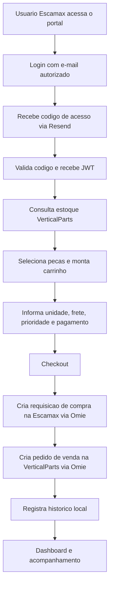

# Portal Escamax - AprovacaoCompra

Portal B2B para consulta de pecas, montagem de carrinho e aprovacao/criacao de pedidos entre a **Escamax** e a **VerticalParts**, com integracao direta ao **Omie**.

Este projeto funciona como uma ponte operacional entre duas empresas:

- **Escamax**: empresa compradora/requisitante, com unidades como Sao Paulo, Brasilia, Salvador, Florianopolis e Picarras.
- **VerticalParts**: empresa fornecedora das pecas, responsavel pelo estoque e pelo pedido de venda.

Na pratica, o usuario da Escamax entra no portal, consulta o estoque disponivel da VerticalParts, seleciona pecas, informa unidade, finalidade, frete, prioridade e pagamento, e o sistema tenta criar automaticamente:

1. uma **Requisicao/Pedido de Compra** na conta Omie da unidade Escamax;
2. um **Pedido de Venda** na conta Omie da VerticalParts.

---

## Visao de Portfolio

O **Portal Escamax - AprovacaoCompra** e um sistema interno de automacao comercial e operacional. Ele reduz o trabalho manual de cotacao, conferencia de estoque, montagem de pedido e lancamento duplicado entre empresas.

### Problema resolvido

Antes de um sistema assim, uma compra entre Escamax e VerticalParts tende a depender de mensagens, planilhas, consulta manual de estoque, aprovacao informal e lancamentos repetidos em sistemas diferentes.

Este projeto centraliza esse fluxo em uma interface unica:

- consulta produtos da VerticalParts;
- mostra estoque, preco e categoria;
- permite montar carrinho;
- trata pecas sem estoque como demanda;
- coleta dados comerciais essenciais do pedido;
- envia o processo para o Omie;
- registra historico e status dos pedidos criados.

### Valor para o negocio

- Menos retrabalho administrativo.
- Menos erro de digitacao entre contas Omie.
- Maior rastreabilidade entre compra Escamax e venda VerticalParts.
- Visao de historico e indicadores de pedidos.
- Processo padronizado para diferentes unidades Escamax.
- Base tecnica preparada para evoluir para aprovacao formal, auditoria e governanca.

---

## Principais Recursos

### Autenticacao por e-mail

O acesso e restrito ao e-mail administrativo da Escamax. O backend gera um codigo de 6 digitos, envia via Resend e valida o codigo antes de liberar o portal.

Recursos envolvidos:

- login por e-mail;
- codigo temporario;
- token JWT com validade;
- rotas protegidas no backend;
- sessao persistida no navegador via `localStorage`.

### Consulta de estoque VerticalParts

O portal consulta produtos no Omie da VerticalParts, filtra itens com prefixo de produto VP e estoque positivo, calcula preco para Escamax e classifica por categoria.

Categorias identificadas:

- Corrimaos;
- Escada/Esteira;
- Elevadores;
- BST/Monarch;
- Outros.

### Carrinho de compras B2B

O usuario seleciona itens e monta um carrinho com:

- unidade Escamax requisitante;
- finalidade do material: revenda ou aplicacao;
- prioridade: balcao, urgente ou normal;
- tipo de frete: CIF, FOB ou transportadora;
- condicoes de pagamento;
- itens, quantidades e valores.

Para corrimaos, o sistema possui tratamento especial por medida em milimetros.

### Integracao Omie

O backend conversa com a API do Omie para:

- listar produtos;
- consultar estoque;
- localizar cliente/fornecedor por CNPJ;
- criar requisicao de compra na unidade Escamax;
- criar pedido de venda na VerticalParts;
- consultar pedido criado;
- atualizar despesas de pedido de compra quando houver IPI.

### Historico de pedidos

Cada checkout gera um registro local em `server/data/orders.json`, com:

- unidade;
- data/hora;
- itens;
- status da requisicao de compra;
- status do pedido de venda;
- detalhes de erro quando houver falha.

### Dashboard

O dashboard agrega os pedidos registrados e mostra:

- total de pedidos;
- valor total;
- taxa de sucesso;
- meses ativos;
- pedidos por mes;
- valor por mes;
- resumo mensal.

### Pecas sem estoque

Quando o usuario tenta adicionar uma peca sem estoque, o portal nao simplesmente descarta a tentativa. Ele registra uma demanda local no navegador para acompanhamento posterior.

---

## Fluxo Operacional



---

## Arquitetura

O projeto e dividido em duas aplicacoes principais:

| Camada | Pasta | Tecnologia | Responsabilidade |
|---|---|---|---|
| Frontend | `client/` | React + Vite + Tailwind | Interface do portal, login, consulta, carrinho, historico e dashboard |
| Backend | `server/` | Node.js + Express | Autenticacao, API interna, integracao Omie, envio de e-mail e persistencia local |

### Frontend

Tecnologias principais:

- React 18;
- React Router;
- Vite;
- Tailwind CSS;
- Axios/fetch;
- Lucide React;
- cache local/IndexedDB via hook de produto.

Rotas principais:

| Rota | Tela | Objetivo |
|---|---|---|
| `/login` | LoginPage | Solicitar e validar codigo de acesso |
| `/` | SearchPage | Consultar pecas e montar carrinho |
| `/history` | HistoryPage | Ver historico de pedidos |
| `/sem-estoque` | PecasSemEstoquePage | Acompanhar demandas sem estoque |
| `/dashboard` | DashboardPage | Ver indicadores dos pedidos |

### Backend

Tecnologias principais:

- Express;
- CORS;
- Dotenv;
- Axios;
- JSON Web Token;
- Resend;
- Nodemailer;
- Winston.

Rotas principais:

| Rota | Metodo | Protegida | Objetivo |
|---|---:|---:|---|
| `/api/auth/login` | POST | Nao | Gerar codigo de acesso |
| `/api/auth/verify` | POST | Nao | Validar codigo e emitir JWT |
| `/api/parts/listar` | GET | Sim | Listar produtos disponiveis |
| `/api/parts/search?q=` | GET | Sim | Buscar produtos por codigo/descricao |
| `/api/checkout/diag` | GET | Sim | Diagnosticar cadastros entre filial e VP |
| `/api/checkout/processar` | POST | Sim | Criar requisicao de compra e pedido de venda |
| `/api/orders` | GET | Sim | Listar historico de pedidos |
| `/api/orders/stats` | GET | Sim | Gerar estatisticas para dashboard |
| `/health` | GET | Nao | Health check do backend |

---

## Arvore, Ramos e Galhos do Projeto

### Arvore

A arvore do projeto e o **Portal Escamax**: uma aplicacao B2B que conecta Escamax, VerticalParts e Omie em um fluxo unico de compra e venda.

### Ramos

Os ramos principais sao:

1. **Interface do usuario**: login, busca, carrinho, historico e dashboard.
2. **API interna**: rotas Express que protegem e organizam as operacoes.
3. **Integracao Omie**: chamadas para estoque, produtos, clientes, fornecedores, compra e venda.
4. **Autenticacao**: codigo por e-mail e JWT.
5. **Persistencia operacional**: historico em JSON e demandas locais no navegador.
6. **Ferramentas de diagnostico**: scripts de teste/debug para Omie.

### Galhos

```text
AprovacaoCompra/
|-- README.md
|-- start_escamax.bat
|-- client/
|   |-- package.json
|   |-- vite.config.js
|   |-- tailwind.config.js
|   |-- index.html
|   `-- src/
|       |-- App.jsx
|       |-- main.jsx
|       |-- index.css
|       |-- assets/
|       |   `-- vp-logo.png
|       |-- context/
|       |   `-- AuthContext.jsx
|       |-- hooks/
|       |   `-- useProductCache.js
|       |-- components/
|       |   |-- Sidebar.jsx
|       |   `-- CartSidebar.jsx
|       `-- pages/
|           |-- LoginPage.jsx
|           |-- SearchPage.jsx
|           |-- HistoryPage.jsx
|           |-- DashboardPage.jsx
|           `-- PecasSemEstoquePage.jsx
|-- server/
|   |-- package.json
|   |-- server.js
|   |-- nodemon.json
|   |-- routes/
|   |   |-- auth.js
|   |   |-- parts.js
|   |   |-- checkout.js
|   |   `-- orders.js
|   |-- controllers/
|   |   |-- authController.js
|   |   |-- partsController.js
|   |   `-- checkoutController.js
|   |-- services/
|   |   |-- omieClient.js
|   |   `-- emailService.js
|   |-- middleware/
|   |   `-- authMiddleware.js
|   |-- utils/
|   |   |-- businessRules.js
|   |   `-- logger.js
|   `-- data/
|       `-- orders.json
`-- scripts de teste/debug Omie
    |-- test_create_purchase*.js
    |-- consult_purchase_order*.js
    |-- list_purchase_orders*.js
    |-- check_etapas.js
    |-- check_ipi_fields.js
    |-- debug_full_checkout.js
    `-- debug_vper010*.js
```

---

## Responsabilidades por Area

### `client/src/pages/LoginPage.jsx`

Tela de login em duas etapas:

1. usuario informa e-mail;
2. sistema envia codigo;
3. usuario valida codigo;
4. portal libera acesso.

### `client/src/pages/SearchPage.jsx`

Tela principal de consulta de estoque:

- busca por codigo ou descricao;
- filtros por categoria;
- visualizacao em lista ou grade;
- modal de detalhes do produto;
- tratamento de corrimao por milimetro;
- registro de demanda quando produto esta sem estoque;
- integracao com carrinho lateral.

### `client/src/components/CartSidebar.jsx`

Carrinho e checkout:

- seleciona unidade Escamax;
- define finalidade;
- define prioridade;
- define tipo de frete;
- coleta dados de transportadora ou endereco quando necessario;
- coleta condicao de pagamento;
- envia checkout para o backend.

### `client/src/pages/HistoryPage.jsx`

Historico operacional:

- lista pedidos registrados;
- filtra por data;
- filtra por unidade;
- mostra status separado da compra Escamax e venda VerticalParts;
- exibe detalhes de erro quando a integracao falha.

### `client/src/pages/DashboardPage.jsx`

Visao gerencial:

- KPIs de pedidos;
- total financeiro;
- taxa de sucesso;
- graficos mensais;
- tabela de resumo por mes.

### `server/controllers/checkoutController.js`

Centro do fluxo B2B:

1. valida unidade e itens;
2. monta observacoes comerciais;
3. identifica CNPJ da VerticalParts e da filial Escamax;
4. cria requisicao de compra na filial Escamax;
5. cria pedido de venda na VerticalParts;
6. consulta IPI;
7. atualiza despesas do pedido de compra quando aplicavel;
8. salva historico.

### `server/services/omieClient.js`

Camada de comunicacao com Omie:

- centraliza chaves por unidade;
- chama endpoints Omie;
- lista produtos e estoque;
- mantem cache simples de estoque;
- converte codigo VP para codigo filial Escamax;
- localiza produtos por codigo;
- clona produto da VP para filial quando necessario;
- cria pedido de venda;
- cria requisicao de compra;
- consulta cliente/fornecedor;
- atualiza despesas.

### `server/services/emailService.js`

Servico de envio de codigo de acesso via Resend.

Tambem possui suporte a `DEV_EMAIL_OVERRIDE`, util quando o dominio de envio ainda nao esta verificado e os e-mails precisam ser redirecionados em desenvolvimento.

---

## Integracao Omie

O sistema utiliza a API do Omie como fonte operacional.

### Conta VerticalParts

Usada para:

- consultar catalogo;
- consultar estoque;
- criar pedido de venda;
- consultar pedido de venda;
- identificar cliente Escamax por CNPJ.

### Contas Escamax

Usadas por unidade:

- `PICARRAS`;
- `BRASILIA`;
- `SAOPAULO`;
- `FLORIANOPOLIS`;
- `SALVADOR`.

Cada unidade pode ter suas proprias credenciais Omie e CNPJ.

### Conversao de codigo

O sistema assume que produtos VerticalParts usam codigos com prefixo `VP` e que a filial Escamax pode usar prefixo convertido para `FORESC`.

Exemplos:

| Codigo VP | Codigo filial |
|---|---|
| `VPEL-010` | `FORESCEL-010` |
| `VPB-3003` | `FORESCB-3003` |
| `VP-Handrail` | `FORESC-Handrail` |

---

## Regras de Negocio

### Preco Escamax

O preco exibido para Escamax e calculado com desconto fixo sobre o valor unitario vindo do Omie:

```text
preco_escamax = valor_unitario * 0.75
```

Ou seja, aplica-se desconto de 25%.

### Categorias

| Prefixo | Categoria |
|---|---|
| `VPB-` | BST/Monarch |
| `VPEL-` | Elevadores |
| `VPER-` | Escada/Esteira |
| `VP-`, `VPP-`, `VPPU-` | Corrimaos |
| demais | Outros |

### Produtos excluidos do estoque de revenda

Na listagem de estoque, alguns prefixos internos sao filtrados para evitar mostrar itens que nao devem entrar no portal de revenda, como kits, materiais internos ou codigos administrativos.

### Corrimaos

Corrimaos podem ser tratados por medida. O frontend permite informar milimetros e calcula o valor proporcional.

### Pecas sem estoque

Quando um produto sem estoque e solicitado:

- nao entra no checkout;
- vira demanda local;
- aparece na pagina `Pecas Sem Estoque`;
- pode ser removido posteriormente pelo usuario.

---

## Variaveis de Ambiente

O backend carrega variaveis a partir de `server/.env`.

> Nao versionar o arquivo `.env` com segredos reais.

### Gerais

```env
PORT=3000
JWT_SECRET=...
RESEND_API_KEY=...
DEV_EMAIL_OVERRIDE=...
```

### Omie - VerticalParts

```env
OMIE_APP_KEY=...
OMIE_APP_SECRET=...
CNPJ_VP=...
```

### Omie - unidades Escamax

```env
OMIE_PICARRAS_KEY=...
OMIE_PICARRAS_SECRET=...
CNPJ_PICARRAS=...

OMIE_BRASILIA_KEY=...
OMIE_BRASILIA_SECRET=...
CNPJ_BRASILIA=...

OMIE_SAOPAULO_KEY=...
OMIE_SAOPAULO_SECRET=...
CNPJ_SAOPAULO=...

OMIE_FLORIANOPOLIS_KEY=...
OMIE_FLORIANOPOLIS_SECRET=...
CNPJ_FLORIANOPOLIS=...

OMIE_SALVADOR_KEY=...
OMIE_SALVADOR_SECRET=...
CNPJ_SALVADOR=...
```

### Categorias de compra

O sistema pode usar categorias por finalidade e unidade:

```env
CATEG_REVENDA_PICARRAS=...
CATEG_APLICACAO_PICARRAS=...
CATEG_REVENDA_BRASILIA=...
CATEG_APLICACAO_BRASILIA=...
CATEG_REVENDA_SAOPAULO=...
CATEG_APLICACAO_SAOPAULO=...
CATEG_REVENDA_FLORIANOPOLIS=...
CATEG_APLICACAO_FLORIANOPOLIS=...
CATEG_REVENDA_SALVADOR=...
CATEG_APLICACAO_SALVADOR=...
```

---

## Como Rodar em Desenvolvimento

### Opcao 1 - Windows com script

Na raiz do projeto:

```bat
start_escamax.bat
```

O script:

1. verifica Node.js;
2. instala dependencias do backend;
3. inicia backend em nova janela;
4. instala dependencias do frontend;
5. inicia Vite;
6. orienta acesso em `http://localhost:5173`.

### Opcao 2 - Manual

Terminal 1:

```bash
cd server
npm install
npm run dev
```

Terminal 2:

```bash
cd client
npm install
npm run dev
```

URLs padrao:

```text
Frontend: http://localhost:5173
Backend:  http://localhost:3000
Health:   http://localhost:3000/health
```

---

## Credenciais de Teste

O login operacional esperado e:

```text
adm@escamax.com.br
```

O codigo de acesso e enviado por e-mail quando `RESEND_API_KEY` esta configurada corretamente. Em desenvolvimento, o backend tambem registra o codigo no terminal.

Existe um codigo de emergencia para testes locais:

```text
123456
```

---

## Scripts de Diagnostico e Teste

A raiz do projeto e a pasta `server/` possuem varios scripts auxiliares para investigar comportamento da API Omie.

Exemplos de familias de scripts:

| Arquivo/padrao | Finalidade provavel |
|---|---|
| `test_create_purchase*.js` | Testes sucessivos de criacao de compra |
| `consult_purchase_order*.js` | Consulta de pedidos de compra |
| `list_purchase_orders*.js` | Listagem de pedidos |
| `debug_vper010*.js` | Diagnostico especifico de produto/codigo |
| `check_etapas.js` | Conferencia de etapas/fases Omie |
| `check_ipi_fields.js` | Investigacao de campos de IPI |
| `find_omie_method.js` | Pesquisa de metodos/endpoints Omie |

Esses scripts documentam o processo de descoberta tecnica da integracao e ajudam a manter rastreabilidade de problemas encontrados durante a construcao.

---

## Persistencia

### Backend

O historico de pedidos e salvo em:

```text
server/data/orders.json
```

Esse arquivo funciona como persistencia simples local.

### Frontend

O navegador usa `localStorage` para:

- token de sessao;
- carrinho;
- demandas de pecas sem estoque.

---

## Seguranca e Cuidados

Pontos importantes:

- Nao versionar `.env`.
- Nao colocar chaves Omie, JWT ou Resend no README.
- Rotas de pecas, checkout, historico e dashboard exigem JWT.
- O codigo de emergencia `123456` deve ser tratado como recurso de desenvolvimento/teste.
- Em producao, o armazenamento de codigos 2FA em memoria deveria ser substituido por Redis ou mecanismo persistente com expiracao.
- `server/data/orders.json` e persistencia simples; para producao, o ideal e banco de dados.
- Logs devem evitar exposicao de segredos completos.

---

## Leitura Tecnica do Projeto

Este repositorio mostra um projeto em estagio funcional de integracao real, com caracteristicas de MVP avancado:

- frontend ja navegavel;
- backend modular;
- integracao externa complexa;
- regras comerciais especificas;
- tratamento de multiplas unidades;
- historico operacional;
- dashboard;
- scripts de investigacao tecnica;
- fluxo B2B entre duas empresas.

A principal forca do projeto esta na automacao da rotina entre Escamax e VerticalParts. Ele nao e apenas um catalogo de pecas: e uma camada de processo que tenta transformar uma compra interna em registros consistentes no Omie dos dois lados da operacao.

---

## Possiveis Evolucoes

Ideias naturais de proxima fase:

- substituir `orders.json` por banco de dados;
- criar tabela de auditoria de eventos;
- separar ambientes de homologacao e producao;
- remover codigo fixo de emergencia em producao;
- criar painel administrativo para categorias, CNPJs e unidades;
- adicionar aprovacao formal antes do checkout;
- adicionar permissao por usuario/unidade;
- criar integracao de notificacao por e-mail/WhatsApp apos pedido;
- registrar numero de pedido com link direto para Omie;
- criar fila de reprocessamento para falhas parciais;
- criar testes automatizados para checkout e regras de negocio.

---

## Resumo Executivo

O **Portal Escamax - AprovacaoCompra** e uma solucao B2B para conectar o estoque e a operacao comercial da VerticalParts com as necessidades de compra das unidades Escamax. Ele organiza o processo desde a consulta de pecas ate a criacao de documentos no Omie, com autenticacao, carrinho, regras comerciais, historico e dashboard.

Como projeto de portfolio, demonstra capacidade de construir uma aplicacao full stack com integracao ERP, regras de negocio reais, automacao operacional e interface administrativa focada em produtividade.
